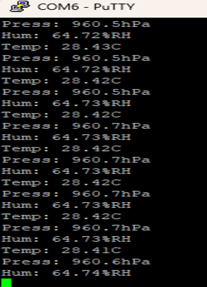

# FPGA_BME280_Sensor
# Weather Station with BME280 Sensor

**Author:** VoltVersa  
**Institution:** Thomas More, 2025  

---

##  Introduction

This project is meant to create a complete telemetry pipeline that reads **temperature, humidity, and pressure** from a **BME280 sensor** and prints them via **UART** and a **7-segment display** on an FPGA board.  

A laptop receives data over UART and runs a simple Python script to log them into a file. These values are then transferred to an **Apache server** using PHP, enabling an **STM32 Disco board** to fetch the data from the server using **LwIP (HTTP)**.

The **BME280 sensor** communicates via **I²C**. To calculate measurements (temperature, humidity, pressure), calibration registers must be read first.
---

---
## Block Diagram
[Open the PDF](Block_diagram.pdf)

--- 
##  BME280 I²C Calibration Registers

- **Endianness:** multi-byte values are little-endian (LSB at lower address).  
- **Types:** `dig_T1`, `dig_P1`, `dig_H1` are unsigned; all others are signed two’s complement.  

| Quantity | Coeff | LSB Addr | MSB Addr | Notes |
|----------|-------|----------|----------|-------|
| Temp     | dig_T1 | 0x88 | 0x89 | unsigned |
|          | dig_T2 | 0x8A | 0x8B | signed   |
|          | dig_T3 | 0x8C | 0x8D | signed   |
| Pressure | dig_P1..dig_P9 | 0x8E–0x9F | | mix signed/unsigned |
| Humidity | dig_H1..dig_H6 | 0xA1, 0xE1–0xE7 | | includes split nibbles |

**Raw data formulas:**
- `temp_raw = (MSB << 12) | (LSB << 4) | (XLSB >> 4)`  
- `press_raw = (MSB << 12) | (LSB << 4) | (XLSB >> 4)`  
- `hum_raw = (MSB << 8) | LSB`  

**Compensation:**
- Use Bosch formulas with calibration data.  
- Compute `t_fine` from temperature, then reuse it for pressure and humidity.  
- Outputs: Temperature (°C), Pressure (Pa or hPa), Humidity (%RH).

---

##  Code Structure

### 1. `i2c_clk_gen`
Generates a 100 kHz SCL from the FPGA’s 100 MHz system clock.  
Formula:  
f_scl = f_clk / (2 × DIVISOR)

### 2. `I2C_Master`
Implements a 3-phase FSM:
1. **Configuration write** 
   

2. **Register pointer writes** (set target addresses)
   

3. **Data reads** (store into buffers)  
   

Timing uses delays (`2.5 µs`, `5 µs`, `10 µs`) derived from generics.  
Handles **START/STOP**, ACK/NACK, and byte sequencing.

### 3. Compensation Entities
- `temp_compensation`, `hum_compensation`, `pres_compensation`  
- Convert raw values into real-world units using calibration data.

### 4. UART TX
A baud-driven FSM outputs results over UART at **9600 baud**:
- Start bit → 8 data bits (LSB first) → Stop bit(s)

### 5. 7-Segment Driver
- Displays 4 digits (time-multiplexed).  
- Converts 16-bit BCD input into segment signals.  
- Includes decimal point and unit indicators.

### 6. Top FSM
- Orchestrates I²C reads, compensation, and UART transmission.  
- States: `idle → start_i2c → wait_i2c_done → wait_comp_done → prepare_uart → send_uart → idle`

---

##  Verification
- Logic analyzer confirmed **correct START/STOP**, ACKs, addressing, and byte assembly.
  
  

- Test_Bench I2C_Master
  
  
  

- Timing goals achieved: **100 MHz system clock, 100 kHz I²C, 9600 UART**.  
- Modular structure makes it easy to extend.

---
## Uart 
  

---
## 📝 Conclusion
This project demonstrates a **complete FPGA-based environmental sensing system** with the BME280:

- Custom I²C master (100 kHz)  
- Compensation modules for accurate values  
- UART output for logging  
- 7-segment display for live feedback  

It achieves **reliable sensor acquisition**, **clean separation of concerns**, and a **scalable, reusable design**.

---
